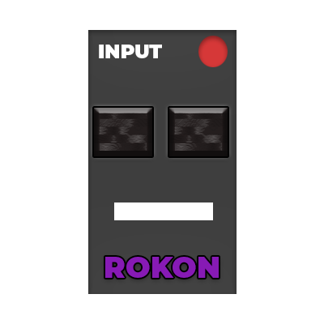

  

      
      <h1 align="center" >Rokon (Roku Remote for your computer) </h1>
  

  

    <b> Control your Roku from your Desktop or Laptop or whatever can output a display. Forget the batteries.</b>
  

 

  
  
    
		
    
		
    
    
    

<h2>Get it on Linux</h2>

  

<h2>Get it on Windows</h2>

Windows 10+ is supported. Old versions of Windows are not.

Packages for Windows are a WIP. I plan to target:

- Winget
- Scoop
- Chocolately

Windows on ARM binaries will be investigated later as cross compiling this application has always yielded poor results and I don't have any Windows devices that are ARM64.

<h2>Get it on macOS </h2>

macOS Monterey+ is supported. Old versions of macOS are not.

Packages for macOS are a WIP. I plan to target:

All the packages on macOS should be fat, meaning they contain support for Apple's M series (aarch64) processors and Apple's macbooks that contain Intel processors (x86_64)

Unless it violates a packaging policy.

- Homebrew
- MacPorts
- *.dmg *.app

 

> **Note:** This project is still in development and is not yet ready for use. Please check back later for updates.

> This application was rewritten from Electron to Go for performance and stability reasons.

> Also, none of the features listed below are implemented yet. This is a roadmap for the future.

This application provides a remote control interface for Roku devices, utilizing the Roku External Control Protocol (ECP) API. It allows users to control their Roku device from their desktop or laptop, providing a more convenient and efficient way to interact with their TV. The app offers a sleek interface with various functions such as navigation, volume control, input selection, typing, and more. It also supports features like Neovim Mode, automatic Roku discovery, DiscordRPC integration, and more. With Rokon, you can control your Roku device remotely with ease and speed, all without the noise of a traditional remote. All powered by Golang and GTK4.

## Features

- Control your Roku device remotely with a sleek interface.
- Supports various functions such as navigation, volume control, input selection, typing, and so much more.
- **Speed**, go faster than any Roku remote could dream of, all without the noise.
- Purely use your keyboard to control your TV (Neovim Mode)
- Automatic Roku Discovery via [SSDP](https://www.pcmag.com/encyclopedia/term/ssdp) (You can manually input your Roku IP)
- Search your installed Roku apps and channels and quickly launch them. (Roadmap)
- DiscordRPC integration, display what you're doing on your Roku on Discord!
- [ActivityWatch](https://activitywatch.net/) integration (Roadmap)
- Option to run on startup and optionally turn on your Roku
- Use open source LLM to convert speech to text for voice control (Roadmap)
- Use your Xbox or PlayStation controller to control your Roku (Roadmap)
- Scripting functionatlity (Roadmap)
- CLI (Roadmap)
- Run actions such as auto scanning at a certain time (Roadmap)
- Webhook support (Roadmap)
- Installing channels (Roadmap)
- Launching things like YouTube with a video (Roadmap)
- Theming Support on Windows and macOS (Roadmap)

## Screenshots

Below is an example screenshot of the application:

_(Screenshot taken on March 11, 2024)_

## Installation

To install the app, simply download the appropriate installer for your platform from the [releases page](https://github.com/BrycensRanch/Rokon/releases) and follow the installation instructions.

## Usage

Once installed, launch the application, and you'll be greeted with a remote control interface. Use the buttons to control your Roku device.

## Roku ECP API Integration

The application communicates with Roku devices using the Roku External Control Protocol (ECP) API. This allows for seamless control and interaction with Roku devices.

> This application is not affiliated with Roku, Inc. in any way.
> All product names, logos, and brands are property of their respective owners. All company, product, and service names used in this website are for identification purposes only.

## License

- My code is licensed under [`AGPL-3.0-or-later`](./LICENSE.md)
- My assets for example Rokon's logo is licensed under [`CC-BY-SA-4.0`](./assets/LICENSE.md)
- Rokon's documentation is licensed under [`GFDL-1.3`](https://raw.githubusercontent.com/IQAndreas/markdown-licenses/master/gnu-fdl-v1.3.md)

Rokon is free software as defined by the [FSF](https://fsf.org). It collects telemetry data by default, see [PRIVACY.md](./PRIVACY.md)

## Undocumented API Calls

Additionally, the app leverages some undocumented API calls to gain an edge over the competition, providing enhanced functionality and a better user experience.
